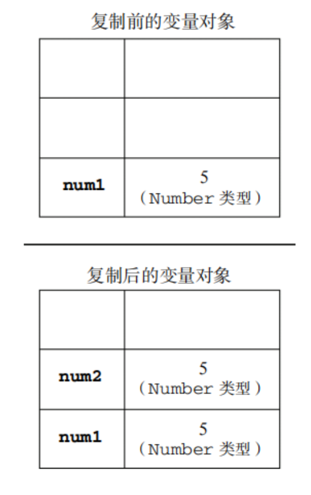
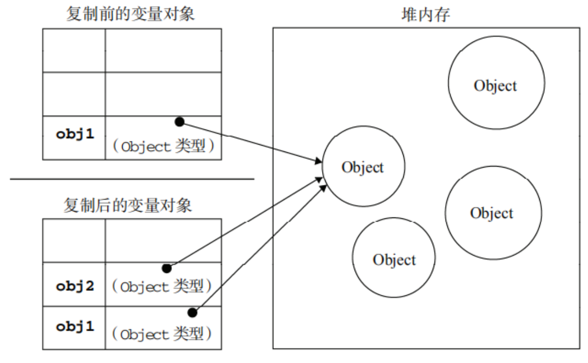

# 基本类型 VS 引用类型

Description: What is it and the differences between each other

## What is it

### 基本类型（值类型）：

数值(number)、布尔值(boolean)、null、undefined、string(在赋值传递中会以引用类型的方式来处理)还有 Symbol(ES6)。

### 详解：

> - 占用空间固定，保存在栈中
>   - 当一个方法执行时，每个方法都会建立自己的内存栈，在这个方法内定义的变量将会逐个放入这块栈内存里，随着方法的执行结束，这个方法的内存栈也将自然销毁了。因此，所有在方法中定义的变量都是放在栈内存中的；栈中存储的是基础变量以及一些对象的引用变量，基础变量的值是存储在栈中，而引用变量存储在栈中的是指向堆中的数组或者对象的地址，这就是为何修改引用类型总会影响到其他指向这个地址的引用变量。
> - 保存与复制的是值本身
> - 使用 typeof 检测数据的类型（**_typeof 也只能区分值类型，碰到引用类型只能区分 Obj 和 Func 类型_**）
> - 基本类型数据是值类型

Eg:

主要针对

- **_保存与复制的是值本身_**

```JavaScript
  var a = 100
  var b = a
  a = 200
  console.log(b) // 100 - 保存与复制的是值本身
```



---

### 引用类型：

对象（Object）、数组（Array）、函数（Function）、Map、Set ...

### 详解：

> - 占用空间不固定，保存在堆中(特指保存数据所开辟的空间)
>   - 当我们在程序中创建一个对象时，这个对象将被保存到运行时数据区中，以便反复利用（因为对象的创建成本通常较大），这个运行时数据区就是**_堆内存_**。堆内存中的对象不会随方法的结束而销毁，即使方法结束后，这个对象还可能被另一个引用变量所引用（方法的参数传递时很常见），则这个对象依然不会被销毁，只有当一个对象没有任何引用变量引用它时，系统的垃圾回收机制才会在核实的时候回收它。
> - 保存与复制的是指向对象的一个指针
> - 使用 instanceof 检测数据类型
> - 使用 new()方法构造出的对象是引用型

Eg:

```JavaScript
var a = {age:20}
var b = a
b.age = 21
console.log(a.age) // 21
```

```JavaScript
var obj1 = new Object();
var obj2 = obj1;
obj1.name = "Nicholas";
alert(obj2.name); //"Nicholas"
```



---

## 对比：

### 参数传递

&emsp; 先上代码

```JavaScript
//值类型：
function addTen(num) {
 num += 10;
 return num;
}

var count = 20;
var result = addTen(count);

alert(count); //20，没有变化
alert(result); //30
```

```JavaScript
//引用类型：
//example 1.
function setName(obj) {
  obj.name = 'B';
}

var person = new Object();
person.name = 'A';

setName(person);
console.log(person.name); // B

//example 2.
function setName(obj) {
 obj.name = "Nicholas";
 obj = new Object();
 obj.name = "Greg";
}

var person = new Object();

setName(person);
console.log(person.name); //"Nicholas"
```

先解释两种类型作为参数传递时发生了什么：

- 值类型： 在向参数传递基本类型的值时，被传递的值会被复制给一个局部变量。
  - 即命名参数，或者用 ECMAScript 的概念来说，就是 arguments 对象中的一个元素）。
- 引用类型： 在向参数传递引用类型的值时，会把这个值在内存中的地址复制给一个局部变量，因此这个局部变量的变化会反映在函数的外部。


但是引用类型的第二个例子却看上去与之相悖，如果 person 是按引用类型传递的，那么 person 就会自动被修改为指向其 name 属性值为"Greg"的新对象。但是，当接下来再访问 person.name 时，显示的值仍然是"Nicholas"。

解答：其实这恰恰解释了上一点，***在向参数传递引用类型的值时，会把这个值在内存中的地址复制给一个局部变量***"obj"相当于一个局部变量，指向了那个person，但 ```obj = new Object();``` 改变了obj的指向，所以此时person与obj分别指向了两个***不同***的地址，修改互不影响。同时，在此函数方法结束后，局部变量全部清除，obj也被回收，正所谓来无影，去无踪。

---
Material Link
 - [MDN-原始数据类型](https://developer.mozilla.org/zh-CN/docs/Glossary/Primitive)
 - [对比详解](https://www.cnblogs.com/leiting/p/8081413.html)
 - [知乎接地气式讲解](https://juejin.im/post/595616ea5188250da205da91)