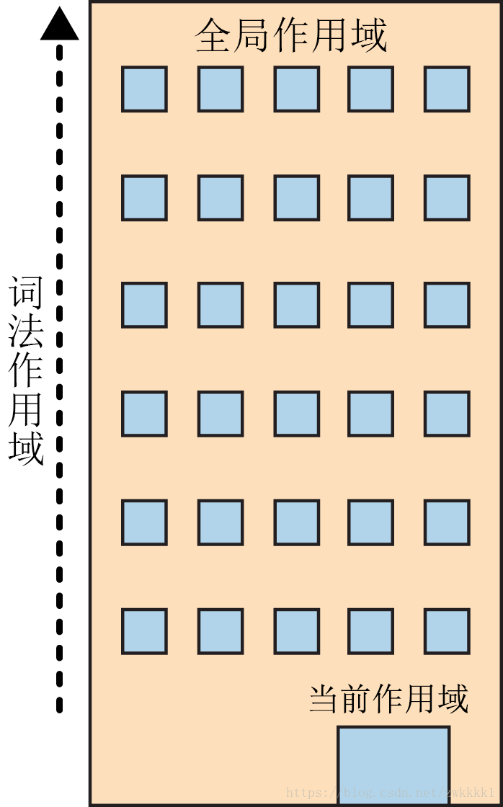

# LHS and RHS

Description: What happen when we declare a variable.

## What is it?

When

```JavaScript
  var a = 2;
```

> 变量的赋值操作会执行两个动作，首先编译器会在当前作用域中声明一个变量（如果之前没有声明过），然后在运行时引擎会在引用域中查找该变量，如果能够找到就会对它赋值。

根据上述描述，代码其实拆分为两个部分：

1. 定义声明在编译阶段进行

```JavaScript
  var a;
```

2. 赋值声明会被留在原地等待执行阶段

```JavaScript
  a = 2;
```

而要讲的 LHS 和 RHS 就是上面说的对变量的两种查找操作，**_---查找---_**的过程是由作用域（词法作用域）进行协助，在编译的第二步中执行。

## LHS 和 RHS

> LHS(Left-hand Side)引用和 RHS(Right-hand Side)引用。通常是指等号（赋值运算）的左右边的引用。

### Foundations

Talk is cheap, check some example

```JavaScript
  console.log(a);
```

这是一个 RHS 引用，因为我们只是想**_查找并取得 a 的值_**

```JavaScript
  a = 2;
```

这是一个 LHS 引用，因为我们并不关心当前的值是什么，只是想要**_为赋值操作找到目标_**。

### 实例练习

**找出所有的 LHS 查询和所有的 RHS 查询**

```JavaScript
  function foo(a) {
	  var b = a;
	  return a + b;
  }

  var c = foo(2);
```

- LHS：

  - 第 6 行的 c = ...，c 在赋值操作的左边，所以对 c 需要 LHS 查询。
  - 隐藏着的 a = 2（隐式变量分配）,在调用 foo(2) 时，需要将实参 2 赋值给形参 a，所以对 a 需要 LHS 查询。
  - 第 2 行的 b = ..., 解释同 1。

- RHS：
  - 第 6 行的 c = foo(2)，foo(2) 在赋值操作的右边，需要知道 foo(2)的值，对 foo(2) 需要 RHS 查询。
  - 第 2 行的 b = a， a 在赋值操作的右边，需要知道 a 的值，对 a 需要 RHS 查询。
  - 第 3 行的 return a + b;， 需要知道 a 和 b 的值， 分别对 a 和 b 都进行 RHS 查询。

  > 总结：如果查找的目的是对变量进行赋值，那么就会使用 LHS 查询；
  > 如果目的是获取变量的值，就会使用 RHS 查询。

### 查找操作的具体表现

我们可以用一座建筑来比较，如图：

这个建筑代表储蓄中的嵌套作用域链。第一层楼代表当前的执行作用域，也就是你所在的位置。建筑的顶层代表全局作用域。一路向上嵌套。

LHS 和 RHS 引用都会在当前楼层进行查找，如果没有找到，就会坐电梯前往上一层楼，如果还是没有找到就继续向上，以此类推。一旦抵达顶层（全局作用域），可能找到了你所需的变量，也可能没找到，但无论如何查找过程都将停止。

---

然后，***---重点来了---***

如果 LHS 与 RHS 各自到达了顶端却没有找到变量，会发生不同的情况

> - 不成功的RHS引用会导致抛出 ReferenceError 异常。
> - 不成功的LHS引用会导致自动隐式地创建一个全局变量（非严格模式下），该变量使用LHS引用的目标作为标识符.
> 
>   或者抛出 ReferenceError 异常（严格模式下）。