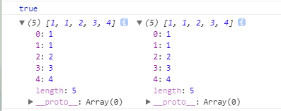

# deepCopy vs shallowCopy

Description: 基本概念，重点放在如何达成 deepCopy

## shallowCopy

eg:

```JavaScript
  let a=[0,1,2,3,4],
  b=a;
  console.log(a===b);
  a[0]=1;
  console.log(a,b);
```



> b=a 只复制了地址

## deepCopy

要实现深拷贝首先需要完全拆解复制对象，然后对每一层进行复制

eg:

```JavaScript
  function deepClone(obj){
    let objClone = Array.isArray(obj)?[]:{};
    if(obj && typeof obj==="object"){
        for(key in obj){
            if(obj.hasOwnProperty(key)){
                //判断ojb子元素是否为对象，如果是，递归复制
                if(obj[key]&&typeof obj[key] ==="object"){
                    objClone[key] = deepClone(obj[key]);
                }else{
                    //如果不是，简单复制
                    //个人理解为进行了一次基本类型的复制
                    objClone[key] = obj[key];
                }
            }
        }
    }
    return objClone;
}

let a=[1,2,3,4],
b=deepClone(a);
a[0]=2;
console.log(a,b);
```


现在 b 脱离了 a 的控制，不再受 a 影响了。

> 上述代码中，比较关键的点是递归判断是否为对象，但凡发现对象就要进行递归，(譬如像这种：[1,2,3,[1,2,3],4])这样有效避免了 shallowCopy.

---

## deepCopy 的方法

### 实现数组深拷贝的一些方法：

- 使用 ES6 的语法

  ```JavaScript
    var a=[1,2,3]
    var [...b]=a;//或b=[...a]
    b.push(4);
    console.log(b);//1,2,3,4
    console.log(a)//1,2,3
  ```

- 使用 concat()

  ```JavaScript
    var a=[1,2,3]
    var c=[];
    var b=c.concat(a);
    b.push(4);
    console.log(b);//1,2,3,4
    console.log(a)//1,2,3
  ```

- 使用 slice()方法

  ```JavaScript
    var a=[1,2,3]
    var b=a.slice(0);
    b.push(4);
    console.log(b);//1,2,3,4
    console.log(a)//1,2,3
  ```

- 使用 JSON 对象的 stringify 和 parse 方法
  ```JavaScript
    var a=[1,2,3]
    var c=JSON.stringify(a);
    var b=JSON.parse(c);
    b.push(4);
    console.log(b);//1,2,3,4
    console.log(a)//1,2,3
  ```

###实现对象深拷贝的方法

```JavaScript
  function deepClone(obj){
    let objClone = Array.isArray(obj)?[]:{};
    if(obj && typeof obj==="object"){
        for(key in obj){
            if(obj.hasOwnProperty(key)){
                //判断ojb子元素是否为对象，如果是，递归复制
                if(obj[key]&&typeof obj[key] ==="object"){
                    objClone[key] = deepClone(obj[key]);
                }else{
                    //如果不是，简单复制
                    //个人理解为进行了一次基本类型的复制
                    objClone[key] = obj[key];
                }
            }
        }
    }
    return objClone;
}
```
